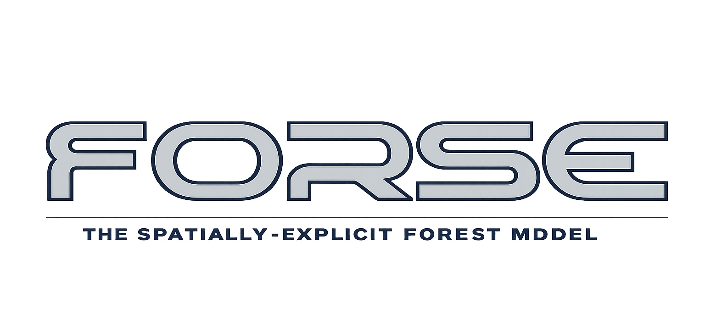

=================================
Welcome to FORSE's documentation!
=================================

The **FOR**\est **S**\patially **E**\xplicit model (FORSE) is a Python based forest gap simulation developed to investigate the dynamics of environmental change in forested ecosystems
related to climate changes and disturbance recovery. The model framework incorporates environmental demographic input data towards a fully spatially and temporally explicity simulation,
including past current and future climate vairables (MERRA2, CMIP6); soild variables (SoilGrids); topography (various DEMs); and solar radiation inputs (LARC). 

Further information about the model, including how to :ref:`install` the model's run environment can be found in the :doc:`pages/usage` section.

.. note::

   This project is under active development.

.. toctree::
    :maxdepth: 2
    :caption: For Users

    Getting Started </pages/usage>
    pages/smce
    pages/running

.. toctree::
    :maxdepth: 2
    :caption: For Developers

    pages/architecture
    pages/simulation
    pages/driver_reference
    pages/extending
