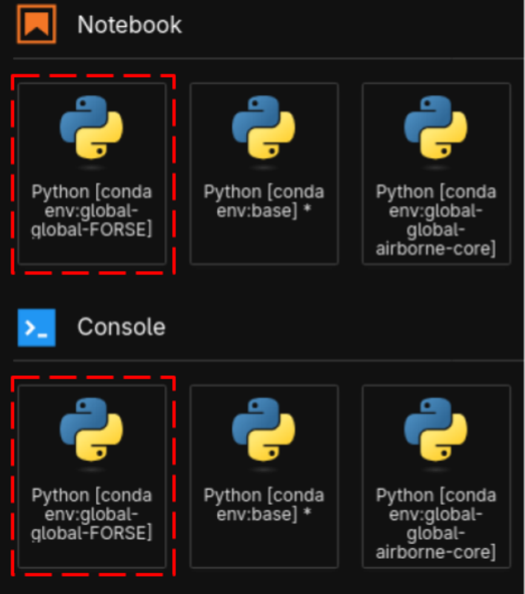

SMCE Instructions
=================

The following instructions apply to users running the FORSE model on NASA's Science Managed Cloud Environment (`SMCE <https://sciencecloud.nasa.gov/overview/>`_)
server.

Access SMCE
-----------

SMCE resources are accessible to those with approved credentials via the `online portal <https://hub.airborne.smce.nasa.gov>`_.
SMCE compute resources are allocated via on demand, virtualized environments relying on an AWS background. For material regarding
appropriate usage of SMCE resources and further tutorials for new users please consult the `SMCE documentation <https://airborne-smce.readthedocs.io/en/latest/>`_

The SMCE FORSE Environment
--------------------------

The full FORSE environment, the contents and purpose of which are described in other sections of this literature, is available to all users via a 
global Conda-Store environment accessed by two entrypoints: the `Notebook` interface, and the `Console` interface.

The `Notebook` provides the user with the familiar Jupyter Notebook interactive interface, allowing the combination of markup text and runnable Python code. 
The `Console` acts as a standard Python REPL (**R**\ead **E**\valuate **P**\rint **L**\oop), being designed for line by line execution of code by a Python interpreter. Most users
will find more value in the `Notebook`, as it allows for more complete scripting and is intended for work that will persist.

Additionally, a full terminal environment is available. This allows the user to interact directly with FORSE in the same was as described in :doc:`pages/usage`. Users working in the terminal
will need to manually activate the Conda environment to run the model.

Interacting With FORSE in Notebook
----------------------------------

Among the most common ways for scripting data processing pipelines in academia is Jupyter Notebooks. They provide a simple way to combine runnable script code with 
explanatory text, while also providing plotting and tabular data representation features. Notebook, like Conda, provides a contained execution environment with a Python interpreter.

FORSE does not directly expose an API that allows it to be called in Python syntax, so in order to script running the model from Jupyter you must use the ``exec()`` function, a member of the
``os`` module. The ``exec()`` function instructs the operating system to execute the command specified by the argument, allowing for this command to run as a separate process. We call the FORSE
model by using ``exec()`` to issue commands that we might have otherwise used in the terminal. For instance, the following command is used to call the FORSE model from the root project directory
in a terminal environment:

.. code-block:: console

    python3 source/forse.py --dem arcticDEM_nfi777611_10m_mf10.tiff driver_latest_nfi777611.py output.hf5

If we wanted to execute this same command from the context of a Notebook, we would do so thusly:

.. code-block:: python
    
    import os

    exec("python3 source/forse.py --dem arcticDEM_nfi777611_10m_mf10.tiff driver_latest_nfi777611.py output.hf5")

Note that the string we pass as an argument is identical to our terminal command from before. 

